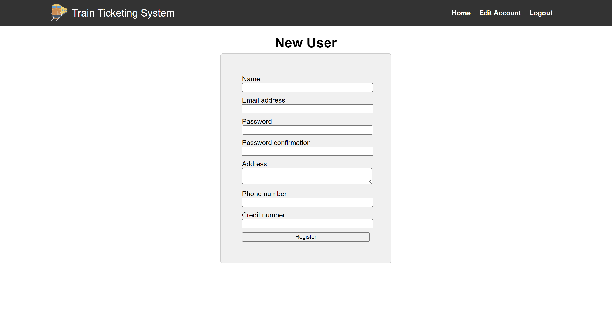

# Train Ticketing System

The project hosts code for project 2 of CSC 517.

The project is a train ticket system with two kinds of users:

* Passenger
* Admin

Specific functionalities of each user is defined [here](https://docs.google.com/document/d/1XhfFJbVkRC0CoQ3mmwE5c4PXdbYRqBy-tsZ0FT5waGA/edit).

you can create your own account for user login.

Credentials of Admin User:

* Username: admin@example.com
* password: admin

Home screen

Signup form

Login form

Passenger screen

Admin screen

view trains screen

we can filter by Depature satation, Destination Station and min rating

Booking train screen

View Train booking screen

creating review screen screen

view review screen

creating users by admin screen

view all users screen

creating trains by admin screen

Testing with Rspec:

- run command `rspec spec -fd`

